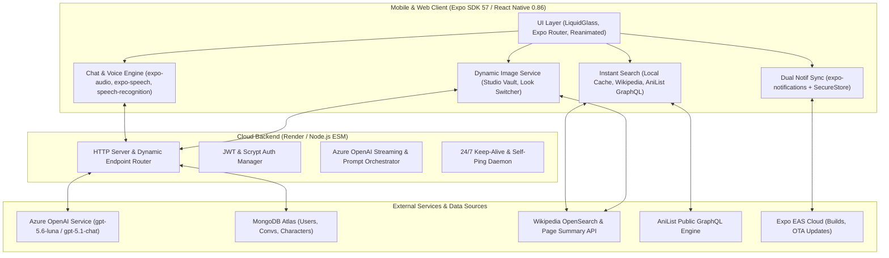
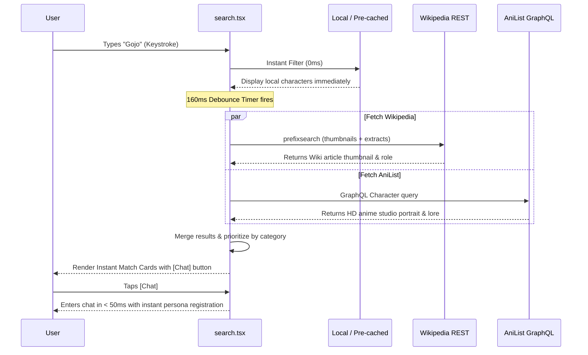
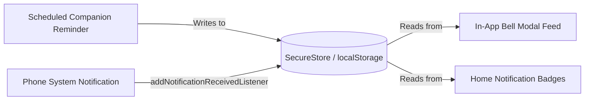

# 📱 GuideTalk: Complete Project & Technical Documentation
**Version:** 1.0.4 &nbsp;|&nbsp; **SDK:** Expo 57 / React Native 0.86 &nbsp;|&nbsp; **Runtime:** Node.js (ESM) + MongoDB Atlas + Azure OpenAI

---

## 📑 Table of Contents
1. [Executive Summary & Architecture Overview](#1-executive-summary--architecture-overview)
2. [Technology Stack & System Dependencies](#2-technology-stack--system-dependencies)
3. [Project Directory & File Structure](#3-project-directory--file-structure)
4. [Deep Architectural Breakdown](#4-deep-architectural-breakdown)
   - [4.1 AI Conversational Engine (Azure OpenAI)](#41-ai-conversational-engine-azure-openai)
   - [4.2 Google-Style Instant Live Search (Wikipedia & AniList)](#42-google-style-instant-live-search-wikipedia--anilist)
   - [4.3 Dynamic Image Engine & "Change Look" Avatar Sync](#43-dynamic-image-engine--change-look-avatar-sync)
   - [4.4 Dual-Layer Notification Synchronization Engine](#44-dual-layer-notification-synchronization-engine)
   - [4.5 Voice Engine: Waveforms, TTS & Speech Recognition](#45-voice-engine-waveforms-tts--speech-recognition)
   - [4.6 Spotlight Carousel, Dynamic Rivals & Prophecy](#46-spotlight-carousel-dynamic-rivals--prophecy)
   - [4.7 User Auth, Guest Mode & Hybrid Persistence](#47-user-auth-guest-mode--hybrid-persistence)
   - [4.8 In-App Update Checker & Intent Installer](#48-in-app-update-checker--intent-installer)
5. [Complete Server REST API Reference](#5-complete-server-rest-api-reference)
6. [Database Schema & Data Models (MongoDB)](#6-database-schema--data-models-mongodb)
7. [Environment Variables & Configuration](#7-environment-variables--configuration)
8. [Build, Deployment & Release Lifecycle](#8-build-deployment--release-lifecycle)
9. [Troubleshooting & Maintenance FAQ](#9-troubleshooting--maintenance-faq)

---

## 1. Executive Summary & Architecture Overview

**GuideTalk** is a production-grade, AI-driven character companion and roleplay platform. It allows users to converse in natural language and voice with iconic figures across anime, cinema, gaming, comic books, and history. 

Each character exhibits an authentic persona, voice, memory, and lore. The system dynamically pulls verified high-resolution portraits, universe background art, and custom voice actor information without requiring manual database entries.



---

## 2. Technology Stack & System Dependencies

### 2.1 Frontend Mobile & Web Client
- **Framework:** Expo SDK 57 (`expo ~57.0.0`)
- **Core Library:** React Native 0.86.3 (`react 19.2.3`, `react-native 0.86.3`)
- **Navigation:** Expo Router v4 (`expo-router ~57.0.22`) with typed routes
- **Language:** TypeScript 6.0 (`strict: true`)
- **Media & Assets:** `expo-image ~57.0.5`, `expo-asset ~57.0.18`
- **Audio & Voice:** `expo-audio ~57.0.5`, `expo-speech ^57.0.3`, `expo-speech-recognition ^57.1.0`
- **Notifications:** `expo-notifications ~57.0.20`
- **Storage:** `expo-secure-store ~57.0.4` (Native Android/iOS) and `localStorage` (Web)
- **UI FX & Glassmorphism:** `expo-blur ~57.0.3`, `expo-linear-gradient ~57.0.2`, `expo-haptics ~57.0.3`
- **App Updates:** `expo-updates ~57.0.23`, `expo-file-system ~57.0.7`, `expo-intent-launcher ~57.0.1`

### 2.2 Backend Server
- **Runtime:** Node.js 20+ (Native ECMAScript Modules `type: "module"`)
- **Framework:** Native Node HTTP server (`node:http`) with custom streaming router
- **Database:** MongoDB Atlas (native `mongodb` driver v6.12.0)
- **Cryptography:** Native `node:crypto` (`scryptSync` password hashing, `timingSafeEqual`, HMAC-SHA256 tokens)
- **Deployment:** Render Cloud Web Service (`https://guidetalk.onrender.com`)

### 2.3 AI & Knowledge Integrations
- **Conversational Intelligence:** Azure OpenAI Service (`gpt-5.6-luna`, `gpt-5.1-chat`)
- **Real-time Live Entity Knowledge:** Wikipedia PrefixSearch & REST Summary APIs
- **Anime Studio Art & Lore:** AniList Public GraphQL API (Zero-dependency native `fetch`)
- **Fallback Imagery:** Unsplash Curated Studio Vault + DiceBear Persona Fallback

---

## 3. Project Directory & File Structure

```
charai/
├── app/                               # Expo Router file-based screens
│   ├── (tabs)/                        # Main Tab Navigator
│   │   ├── _layout.tsx                # Bottom Tab Bar UI with frosted glass
│   │   ├── index.tsx                  # Home screen: Spotlight, Starred, Feed, Rivals
│   │   ├── chats.tsx                  # Recent conversations list & swipe actions
│   │   ├── explore.tsx                # Universe categories, anime & cinema heroes
│   │   └── profile.tsx                # User settings, theme toggle, update banner
│   ├── chat/
│   │   └── [id].tsx                   # Interactive character chat room & look switcher
│   ├── character/
│   │   └── [id].tsx                   # Character detail sheet & universe background
│   ├── search.tsx                     # Google-style live Omnibox search screen
│   ├── onboarding.tsx                 # Language & universe preference setup
│   └── _layout.tsx                    # Root layout with Theme & Auth providers
├── src/                               # Shared client logic & utilities
│   ├── components/                    # Reusable UI components
│   │   ├── LiquidGlassView.tsx        # High-performance glassmorphism container
│   │   └── WaveformVisualizer.tsx     # Animated audio recording visualizer
│   ├── config/                        # App environment & configuration loader
│   │   └── env.ts                     # Fallback API keys, endpoints & deployments
│   ├── context/                       # React context providers
│   │   ├── AuthContext.tsx            # Guest ID, login, registration, token persistence
│   │   └── ThemeContext.tsx           # Obsidian Dark & Clean Light theme engine
│   ├── data/                          # Seed character data & universe definitions
│   │   ├── characters.ts              # Builtin characters (Gojo, Batman, Leo, etc.)
│   │   └── rivals.ts                  # Universe rival mappings & conflict prompts
│   ├── lib/                           # Core service singletons
│   │   ├── chatApi.ts                 # Base URL discovery, streaming chat, Azure calls
│   │   ├── dynamicImageService.tsx    # Multi-look resolution, caching, avatar sync
│   │   └── notificationService.ts     # Dual-layer push & in-app companion reminders
│   └── types/                         # TypeScript interface definitions
│       ├── character.ts               # Character, Candidate, Universe schemas
│       └── theme.ts                   # Color palettes & typographic tokens
├── server/                            # Backend microservice
│   ├── index.mjs                      # HTTP server, AI proxy, auth, MongoDB, scraping
│   ├── package.json                   # Server dependencies
│   └── .env                           # Server secrets (MongoDB URI, Azure OpenAI key)
├── app.json                           # Expo app manifest (permissions, icons, plugins)
├── eas.json                           # Expo Application Services build & OTA profiles
├── package.json                       # Client dependencies & scripts
├── tsconfig.json                      # Strict TypeScript compiler options
└── DOCUMENTATION.md                   # This master documentation document
```

---

## 4. Deep Architectural Breakdown

### 4.1 AI Conversational Engine (Azure OpenAI)
The chat engine in [`app/chat/[id].tsx`](file:///Users/samjoshua/Developer/charai/app/chat/%5Bid%5D.tsx) and [`src/lib/chatApi.ts`](file:///Users/samjoshua/Developer/charai/src/lib/chatApi.ts) connects users directly to Azure OpenAI with conversational roleplay enforcement.

1. **System Prompt Synthesis:**
   Each character has a dynamically assembled system prompt containing:
   - **Identity & Tone:** Core personality traits (e.g. *"Sharp, witty, unyielding, arrogant but caring"*).
   - **Backstory & Lore:** Universe relationships, canonical rules, and current motivations.
   - **Roleplay Protocol:** The AI is strictly instructed to remain in first-person character, avoiding meta statements (e.g. *"As an AI..."* is prohibited).
   - **Conversational Memory:** The last 15 conversation exchanges are injected for contextual awareness.

2. **Multi-Tier Model Fallback:**
   ```
   Primary: Render Backend -> Azure OpenAI Deployment `gpt-5.6-luna`
             │ (if timed out or unreachable)
             ▼
   Fallback: Direct Client -> Azure OpenAI Deployment `gpt-5.1-chat`
             │ (if safety content policy triggered)
             ▼
   Resilience: In-Character Graceful Deflection (Prevents 400 crashes)
   ```

3. **Content Filtering & Safety Handling:**
   If a prompt triggers Azure OpenAI's content management policy (HTTP 400), GuideTalk catches the filter response gracefully and delivers an in-character deflection response (e.g., *"Sukuna smiles coldly: 'Mind your tongue, mortal...'"*) instead of displaying raw JSON error text.

---

### 4.2 Google-Style Instant Live Search (Wikipedia & AniList)
Located in [`app/search.tsx`](file:///Users/samjoshua/Developer/charai/app/search.tsx), search operates as a real-time Google Omnibox with parallel data fetching.



- **0ms Instant Local Match:** Built-in characters and previously saved custom characters appear immediately.
- **160ms Wikipedia Knowledge Graph:** Fetches official portraits and concise biographies for cinema, gaming, comic, and historical figures.
- **AniList GraphQL Engine:** Queries `https://graphql.anilist.co` using pure native `fetch` (0 npm packages) to fetch official anime studio portraits, Japanese native names, and franchise links.
- **Instant Chat Launch:** Tapping any live card calls `selectCandidate`, instantly registers the character in memory and `SecureStore`, and transitions to [`app/chat/[id].tsx`](file:///Users/samjoshua/Developer/charai/app/chat/%5Bid%5D.tsx) in under 50ms.

---

### 4.3 Dynamic Image Engine & "Change Look" Avatar Sync
Located in [`src/lib/dynamicImageService.tsx`](file:///Users/samjoshua/Developer/charai/src/lib/dynamicImageService.tsx), this engine guarantees that characters are never stuck with generic avatars.

1. **Multi-Source Scraping & Studio Vault:**
   - Queries Wikipedia infoboxes, Wikimedia Commons, and the curated Unsplash studio portrait vault.
   - Filters out non-portrait assets (e.g. logos, coats of arms, flags, documents, maps).
2. **Instant "Change Look" Cycling:**
   - In chat, tapping **"Change Look"** cycles through high-resolution alternate visual styles (e.g. comic art, movie still, anime portrait).
3. **Real-Time Message Bubble Sync:**
   - An event emitter architecture (`listeners.forEach(...)`) broadcasts image updates immediately across all rendered chat message bubbles. Past messages and upcoming replies instantly reflect the selected look.

---

### 4.4 Dual-Layer Notification Synchronization Engine
Implemented across [`src/lib/notificationService.ts`](file:///Users/samjoshua/Developer/charai/src/lib/notificationService.ts) and [`app/(tabs)/index.tsx`](file:///Users/samjoshua/Developer/charai/app/%28tabs%29/index.tsx).



- **Single Source of Truth (`PERSISTED_REMINDERS_KEY`):** Both outside-app push notifications and the in-app notification modal read and write to the same persistent store.
- **Verbatim Consistency:** The notification text, title, character avatar, and relative time (`Just now`, `5m ago`, `2h ago`) are identical whether viewed on the lock screen or inside the app.
- **Production Schedule:** Spaced out realistically (**2 hours, 6 hours, 12 hours, 24 hours, 48 hours**) to prevent user fatigue. Reminders are scheduled **only** for characters the user explicitly liked/starred.
- **Interactive Deep Linking:** Tapping an outside push banner marks that item as read in the in-app list and immediately routes to `/chat/${data.characterId}`.

---

### 4.5 Voice Engine: Waveforms, TTS & Speech Recognition
GuideTalk provides hands-free conversational audio:

1. **Voice Note Recording (`expo-audio`):**
   - High-fidelity audio recording with dynamic decibel metering.
   - Real-time animated waveform bars in [`src/components/WaveformVisualizer.tsx`](file:///Users/samjoshua/Developer/charai/src/components/WaveformVisualizer.tsx).
2. **Speech Recognition (`expo-speech-recognition`):**
   - Transcribes spoken audio into chat text with zero latency.
3. **Text-To-Speech Playback (`expo-speech`):**
   - Reads incoming AI messages aloud using pitch, rate, and accent profiles tuned to the character's persona.

---

### 4.6 Spotlight Carousel, Dynamic Rivals & Prophecy
- **Spotlight Carousel ([`app/(tabs)/index.tsx`](file:///Users/samjoshua/Developer/charai/app/%28tabs%29/index.tsx)):** A horizontal cards carousel featuring silky-smooth manual paging, haptic snaps, and a Netflix-style smoky glass backdrop.
- **Dynamic Rivals ([`src/data/rivals.ts`](file:///Users/samjoshua/Developer/charai/src/data/rivals.ts)):** Maps characters to their canonical rivals (e.g. Gojo vs. Sukuna, Batman vs. Joker, Walter White vs. Hank Schrader) and generates dynamic conflict starters.
- **Daily Character Prophecy:** Delivers a randomized in-character daily fortune and motivational quote to the user each morning.

---

### 4.7 User Auth, Guest Mode & Hybrid Persistence
- **Zero-Friction Guest Mode:** First-time users are assigned a unique cryptographic device ID stored in `SecureStore`. They can immediately chat, favorite, and customize characters.
- **Full Account Transition:** Users can optionally sign up with username/password. Conversations and favorites created in Guest Mode automatically migrate to their cloud account on MongoDB Atlas.
- **Security:** Password storage uses Node.js `crypto.scryptSync` with unique cryptographic salts. Session tokens are signed using HMAC-SHA256.

---

### 4.8 In-App Update Checker & Intent Installer
Located in [`app/(tabs)/profile.tsx`](file:///Users/samjoshua/Developer/charai/app/%28tabs%29/profile.tsx):
- **EAS OTA Updates:** Checks Expo Updates (`Updates.checkForUpdateAsync()`) for immediate over-the-air JavaScript runtime patches.
- **Native APK Installer:** If a major native binary update is released, the app queries `/app/version`, downloads the APK with an animated progress bar via `FileSystem.createDownloadResumable`, and launches the Android Package Installer using `IntentLauncher`.

---

## 5. Complete Server REST API Reference

Base URL: `https://guidetalk.onrender.com`

| Method | Endpoint | Auth Required | Description |
| :--- | :--- | :---: | :--- |
| `GET` | `/health` | No | Server status, service health, uptime, and version (`1.0.4`). |
| `POST` | `/auth/register` | No | Creates a user account. Returns user object and JWT bearer token. |
| `POST` | `/auth/login` | No | Authenticates user credentials. Returns JWT bearer token. |
| `GET` | `/auth/me` | Yes | Retrieves authenticated user profile and workspace settings. |
| `POST` | `/chat` | Optional | Standard JSON buffered chat response from Azure OpenAI. |
| `POST` | `/chat/stream` | Optional | Server-Sent Events (SSE) streaming chat response. |
| `GET` | `/conversations` | Optional | Lists recent conversation summaries for user or guest device. |
| `GET` | `/conversations/:id` | Optional | Retrieves stored messages for a specific conversation. |
| `POST` | `/conversations/:id` | Optional | Saves or appends a message to a conversation. |
| `DELETE`| `/conversations/:id` | Optional | Deletes conversation history. |
| `POST` | `/characters/search-multi` | Optional | Generates 6-8 deep universe variations and eras for a search query. |
| `GET` | `/characters/recommendations` | Optional | Personalized character recommendations based on user interests. |
| `GET` | `/characters/dynamic-rivals` | Optional | Dynamically resolves canonical rivals for a given character. |
| `GET` | `/dynamic-image` | No | Searches and resolves high-resolution character portraits. |
| `GET` | `/daily-prophecy` | Optional | Generates in-character daily horoscope and fortune. |
| `GET` | `/app/version` | No | Returns latest version code, changelog notes, and APK download URL. |

---

## 6. Database Schema & Data Models (MongoDB)

### 6.1 `users` Collection
```typescript
interface UserDocument {
  _id: ObjectId;
  username: string;          // Lowercase unique handle
  email?: string;            // Optional user email
  passwordHash: string;      // scrypt hash
  salt: string;              // 16-byte random salt
  name: string;              // Display name
  language?: string;         // 'en', 'es', 'ja', 'ta', etc.
  workspaceCharacterIds: string[]; // User's custom workspace picks
  favoriteCharacterIds: string[];  // Starred characters
  createdAt: Date;
  updatedAt: Date;
}
```

### 6.2 `conversations` Collection
```typescript
interface ConversationDocument {
  _id: ObjectId;
  userId: string;            // User ID or Guest Device ID
  characterId: string;       // Character identifier
  characterName: string;
  characterAvatar?: string;
  messages: Array<{
    id: string;
    role: 'user' | 'character';
    content: string;
    photo?: string | null;
    createdAt: Date;
  }>;
  createdAt: Date;
  updatedAt: Date;
}
```

### 6.3 `custom_characters` Collection
```typescript
interface CustomCharacterDocument {
  _id: ObjectId;
  userId?: string;           // Creator ID
  id: string;                // Slug or custom timestamp ID
  name: string;
  series?: string;
  role: string;
  shortDescription: string;
  description: string;
  category: string;
  personality: string[];
  roleplayRules: string;
  greeting: string;
  avatarUrl: string;
  coverUrl?: string;
  accent: string;
  isOnline: boolean;
  starters: string[];
  isCustom: boolean;
  createdAt: Date;
}
```

---

## 7. Environment Variables & Configuration

### 7.1 Client Configuration (`eas.json` & `.env`)
```ini
EXPO_PUBLIC_API_URL=https://guidetalk.onrender.com
EXPO_PUBLIC_AZURE_OPENAI_ENDPOINT=https://qbssazureopenai.openai.azure.com/
EXPO_PUBLIC_AZURE_OPENAI_DEPLOYMENT=gpt-5.6-luna
EXPO_PUBLIC_AZURE_OPENAI_API_VERSION=2025-01-01-preview
EXPO_PUBLIC_AZURE_OPENAI_API_KEY=your_azure_key_here
```

### 7.2 Server Secrets (`server/.env`)
```ini
PORT=3000
MONGODB_URI=mongodb+srv://<user>:<password>@cluster0.mongodb.net/guidetalk?retryWrites=true&w=majority
AZURE_OPENAI_ENDPOINT=https://qbssazureopenai.openai.azure.com/
AZURE_OPENAI_KEY=your_azure_key_here
AZURE_OPENAI_DEFAULT_DEPLOYMENT=gpt-5.6-luna
JWT_SECRET=your_jwt_hmac_secret_key_here
APP_LATEST_VERSION=1.0.4
APP_LATEST_VERSION_CODE=5
```

---

## 8. Build, Deployment & Release Lifecycle

### 8.1 Local Development
```bash
# 1. Install dependencies
npm install
cd server && npm install && cd ..

# 2. Start local backend server
npm run server

# 3. Start Expo client (Web & Metro bundler)
npm start
```

### 8.2 Building with EAS (Expo Application Services)
```bash
# Preview build: Standalone Android APK for direct phone testing
eas build --platform android --profile preview --non-interactive

# Production build: Optimized AAB bundle for Google Play Store console
eas build --platform android --profile production --non-interactive

# Over-The-Air (OTA) runtime update
eas update --branch production --message "v1.0.4 hotfix"
```

---

## 9. Troubleshooting & Maintenance FAQ

#### Q1: Why do push notifications and in-app notifications have identical content?
**A:** They share a single source of truth (`savePersistedReminder`). When a notification fires to the device tray, its exact title, body, and timestamp are saved to `SecureStore`. When the in-app modal opens, it reads from that exact same record.

#### Q2: How does search work without external npm packages for AniList or Wikipedia?
**A:** AniList provides a public GraphQL API, and Wikipedia provides public REST APIs that require no API keys. GuideTalk queries them directly with native `fetch()`, keeping the app bundle lightweight and avoiding Node.js runtime crashes.

#### Q3: What happens if Azure OpenAI content policies filter a prompt?
**A:** GuideTalk intercepts HTTP 400 content filter responses and returns an in-character narrative reply, ensuring that users never experience raw crash screens or unhandled exceptions.

#### Q4: How are custom character looks preserved?
**A:** Resolved looks are cached in an in-memory Map and persisted to `SecureStore`. The `DynamicCharacterImage` component subscribes to look-change events, updating all message avatars across the screen simultaneously.

---

<div align="center">
  <b>GuideTalk v1.0.4</b> &bull; Built with Expo SDK 57, React Native 0.86, and Azure OpenAI
</div>
